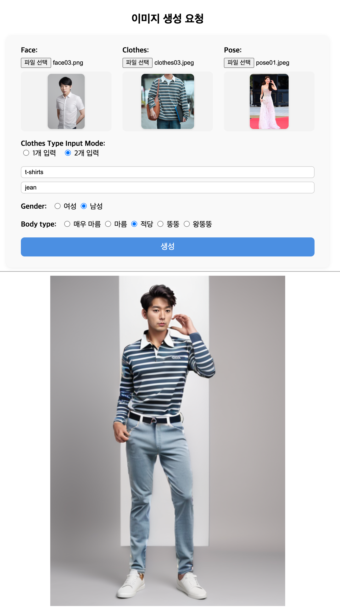

# comfy_face_clothes

# 목표
얼굴사진과 옷사진을 업로드하고, 옷의 유형, 체형에 대해서 입력을 받는다.  
업로드된 사진과 옷의 유형, 체형을 기반으로 이미지를 생성한다.

# 개발 및 테스트 환경
 - MacBook Pro M4 MAX / MacoBook Pro M1 Pro
 - Python 3.12.0
 - asdf python plugin

### ComfyUi 실행 시 발생 시 문제 해결 방법
### _lzma 모듈이 누락되어 발생
아래 명령어 실행 후 다시 셋팅 시작
```
brew install xz
asdf uninstall python 3.12.0 
asdf install python 3.12.0
```

# 사전준비
## ComfyUI 설치 및 실행
`./comfyui-init.sh` 파일 또는 `python comfyui_init.py` 를 실행하면 ComfyUI가 설치되고, 필요한 custom node와 model이 다운로드 됩니다.  
일부 데이터는 workflow 수행 시 다운로드 되기 때문에 시간이 소요될 수 있습니다.  
run.py 를 통해 실행하을 하게 되면 타임아웃이 발생할 가능성이 있기 때문에 comfyui 를 직접 실행한 후 workflows 를 한번 수행하는 것이 좋습니다.  

### 필요 custom node
위에 sh 로 실행 시 설치 됨.
 - https://github.com/ltdrdata/ComfyUI-Manager
 - https://github.com/cubiq/ComfyUI_IPAdapter_plus
 - https://github.com/Fannovel16/comfyui_controlnet_aux
 - https://github.com/ltdrdata/ComfyUI-Impact-Pack
 - https://github.com/kijai/ComfyUI-Florence2
 - https://github.com/storyicon/comfyui_segment_anything
 - https://github.com/cubiq/ComfyUI_essentials
 - https://github.com/Nourepide/ComfyUI-Allor
 - https://github.com/ltdrdata/ComfyUI-Impact-Subpack
 - https://github.com/ltdrdata/was-node-suite-comfyui
 - https://github.com/ai-shizuka/ComfyUI-tbox
 - https://github.com/Curt-Park/human-parser-comfyui-node-in-pure-python

### 필요한 model
models 폴더에 추가 되야 합니다.
 - models/checkpoints/realisticVisionV51_v51VAE.safetensors
   - https://huggingface.co/lllyasviel/fav_models/resolve/main/fav/realisticVisionV51_v51VAE.safetensors?download=true
 - models/ipadapter/ip-adapter-faceid-plusv2_sd15.bin
   - https://huggingface.co/h94/IP-Adapter-FaceID/resolve/main/ip-adapter-faceid-plusv2_sd15.bin?download=true
 - models/ipadapter/ip-adapter-plus_sd15.safetensors
   - https://huggingface.co/h94/IP-Adapter/resolve/main/models/ip-adapter-plus_sd15.safetensors?download=true
 - models/clip_vision/CLIP-ViT-H-14-laion2B-s32B-b79K.safetensors
   - https://huggingface.co/Kuvshin/models-moved/resolve/main/CLIP-ViT-H-14-laion2B-s32B-b79K.safetensors?download=true
 - models/loras/ip-adapter-faceid-plusv2_sd15_lora.safetensors
   - https://huggingface.co/h94/IP-Adapter-FaceID/resolve/main/ip-adapter-faceid-plusv2_sd15_lora.safetensors?download=true
 - models/controlnet/control_v11p_sd15_openpose.pth
   - https://huggingface.co/lllyasviel/ControlNet-v1-1/resolve/main/control_v11p_sd15_openpose.pth?download=true
 - models/ultralytics/bbox/face_yolov8m.pt
   - https://huggingface.co/Bingsu/adetailer/resolve/main/face_yolov8m.pt?download=true
 - models/sams/sam_vit_b_01ec64.pth
   - https://huggingface.co/datasets/Gourieff/ReActor/resolve/main/models/sams/sam_vit_b_01ec64.pth?download=true
 - models/sams/sam_vit_h_4b8939.pth
   - https://huggingface.co/HCMUE-Research/SAM-vit-h/resolve/main/sam_vit_h_4b8939.pth?download=true

# 실행방법
```
pip install -r requirements.txt
python comfyui_init.py
python ComfyUI/main.py
python run.py
```
브라우저에서 `http://127.0.0.1:8000` 로 접속하여 사용합니다.

# 샘플 결과값
## Sample 01
***여성 + 드레스 + 적당한체형***


## Sample 02
***여성 + 드레스 + 왕뚱뚱한체형***


## Sample 03
***남성 + 상의 + 하의 + 적당한체형***


## Sample 04
***남성 + 상의 + 하의 + 왕뚱뚱한체형***
