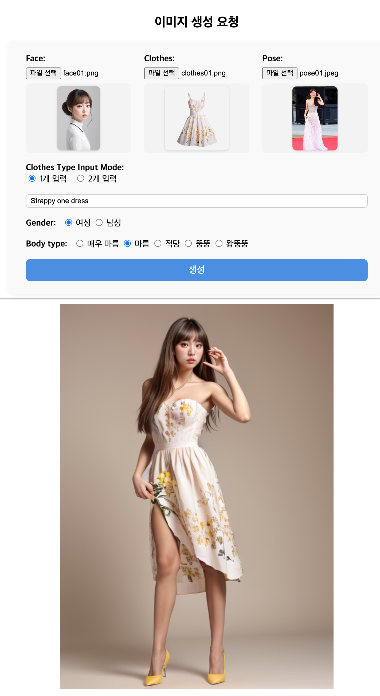

# comfy_face_clothes

# 목표
얼굴사진과 옷사진을 업로드하고, 옷의 유형, 체형에 대해서 입력을 받는다.  
업로드된 사진과 옷의 유형, 체형을 기반으로 이미지를 생성한다.

# 사전준비
## ComfyUI 설치
```
./comfyui-init.sh
```
### 필요 custom node
위에 sh 로 실행 시 설치 됨.
 - https://github.com/ltdrdata/ComfyUI-Manager
 - https://github.com/cubiq/ComfyUI_IPAdapter_plus
 - https://github.com/Fannovel16/comfyui_controlnet_aux
 - https://github.com/ltdrdata/ComfyUI-Impact-Pack
 - https://github.com/kijai/ComfyUI-Florence2
 - https://github.com/storyicon/comfyui_segment_anything
 - https://github.com/cubiq/ComfyUI_essentials
 - https://github.com/Nourepide/ComfyUI-Allor
 - https://github.com/ltdrdata/ComfyUI-Impact-Subpack
 - https://github.com/ltdrdata/was-node-suite-comfyui
 - https://github.com/ai-shizuka/ComfyUI-tbox

### 필요한 model
models 폴더에 추가 되야 합니다.
 - models/checkpoints/realisticVisionV51_v51VAE.safetensors
 - models/ipadapter/ip-adapter-faceid-plusv2_sd15.bin
 - models/ipadapter/ip-adapter-plus_sd15.safetensors
 - models/clip_vision/CLIP-ViT-H-14-laion2B-s32B-b79K.safetensors
 - models/lora/ip-adapter-faceid-plusv2_sd15_lora.safetensors
 - models/controlnet/control_v11p_sd15_openpose.pth
 - models/ultralytics/bbox/face_yolov8m.pt
 - models/sams/sam_vit_b_01ec64.pth / models/sams/sam_vit_h_4b8939.pth

# 실행방법
```
pip install -r requirements.txt
python run.py
```
http://127.0.0.1:8000

# 샘플 결과값
## Sample 01
***여성 + 드레스 + 적당한체형***


## Sample 02
***여성 + 드레스 + 왕뚱뚱한체형***


## Sample 03
***남성 + 상의 + 하의 + 적당한체형***


## Sample 04
***남성 + 상의 + 하의 + 왕뚱뚱한체형***
